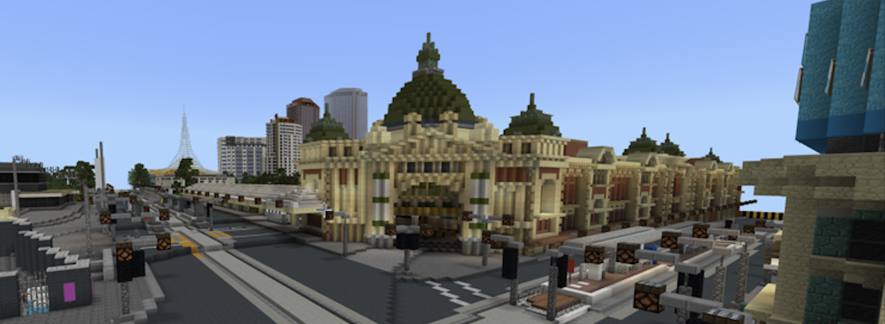

# code+words / week 1 

## + virtual melbourne



We started our first class in the world of Minecraft. This was a great, fun activity to allow every student to virtually interact in an engaging way beyond the regular online learning experience.

## + introduction to processing


```
function setup() {
createCanvas (500,500);
background (250,248,242);
}


function draw() {
strokeWeight (3);
stroke (250-mouseX, (mouseX+mouseY)/4, mouseX/2);
fill (250-mouseX, (mouseX+mouseY)/4, mouseX/2);
ellipse (250,250,300,175);
stroke (250,248,242);
fill (250,248,242);
ellipse (270,250,130,150);
rect (260,235,150,30);
}
```


```
function setup() {
createCanvas (500,500);
background (250,248,242);
}

function draw() {
strokeWeight (3);
stroke (250-mouseX, (mouseX+mouseY)/4, mouseX/2);
line (125,175,125,350);
line (225,350,325,175);
line (100,350,150,350);
line (100,175,125,175);
line (375,175,400,175);
line (300,350,400,350);
strokeWeight (3);
stroke (250-mouseX, (mouseX+mouseY)/4, mouseX/2);
fill (250-mouseX, (mouseX+mouseY)/4, mouseX/2);
rect (325,175,50,175);
quad (125,175,175,175,275,350,225,350);
}
```

Our first introduction to coding involved becoming acquainted with Processing and p5.js. As someone who had no previous coding experience, I found this tutorial easy to follow and replicate myself, which definitely helped to ease some of the apprehension I felt going into the course. We were asked to attempt the software ourselves and recreate our own initials. I really enjoyed the challenges of this task and the immense satisfaction I felt when I finally succeeded. For my [C](https://celiamance.github.io/codewords/SKO/WEEK1/letter_C) and [M](https://celiamance.github.io/codewords/SKO/WEEK1/letter_M), I really enjoyed using the mouseY and mouseX functions to make the fill change fluidly as you moved your mouse. If I were to do this task again, I might try playing with more abstract letterforms or more functions including the mouseY and mouseX commands to change the size or shape the letter.

### [[Next Week]](https://celiamance.github.io/codewords/SKO/WEEK2/)
