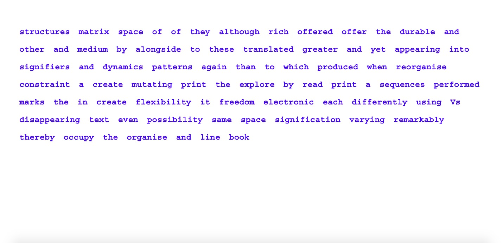
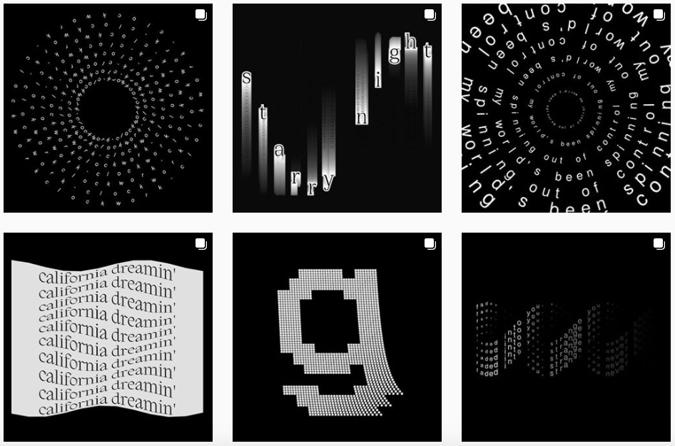

# code+words / week 10

## + sketch progress!



```
// shuffle function added by k.donnachie

var font;
var margin = 60;
var topmargin = 50;
var para = ('although these structures occupy the same space they organise it differently and thereby create mutating patterns of signification translated into a digital medium Vs line sequences reorganise yet again using the flexibility offered by appearing and disappearing text to create a possibility space even greater than the print book when read alongside each other the print and electronic texts offer a remarkably rich matrix in which to explore the varying dynamics of freedom and constraint produced performed by durable marks and flickering signifiers');
var words = para.split(' ');
var wx, wy;
var typesize = 24;
var spacesize = 25;
var linesize = 50;

function preload() {
  font = loadFont('data/CourierStd-Bold.otf');
}

function setup() {
  createCanvas(windowWidth, windowHeight);
  background(255);
  shuffwords = shuffle(words);
  textSize(typesize);
  textFont(font);
}

function draw() {
  background(255);
  fill(0,0,255);
  wx = margin;
  wy = 50;
  var extraSpace = 0;
  for (let w=0; w<words.length; w++) {
    if (wx+textWidth(shuffwords[w])<=width-margin){
    noStroke();
  if (frameCount > 30 * w) {
    text(shuffwords[w], wx, wy+50);
}
  wx+=textWidth(shuffwords[w])+spacesize;
}
else {
  wx=margin;
  wy+=linesize;
  w--;
  }
}
}
```

After struggling some more over the past week with the random words and constraining the text along the x axis, Karen helped me (again, sorry) to make it work - [here is the sketch](https://celiamance.github.io/codewords/SKO/WEEK9/randomtypewords2/)! She added in a shuffle function and I adapted her [sample sketch on split](https://simandy.github.io/codewords/processing/TextToPoints_Para_appearOverTime/) to have the same appearing text that is constrained by adaptive window boundaries.


## + font forge

While discussing the design possibilities for our sketch and looking at the amazing language inclusivity of [Google Noto Fonts](https://www.google.com/get/noto/), Andy also mentioned [Font Forge](https://fontforge.org/en-US/), an open source font editor that you can use to create your own typefaces as an alternative to the expensive software out there. I have always been interested in the process creating my own font, so maybe this is a personal project I will undertake over the summer holidays. And like Andy and Karen said, typefaces are an integral element of design and if you have no experience in creating your own you cannot have a fully self-sufficient practice or even appreciate the intricacies of how each letterform is constructed. Similar to designers having no understanding of code and labelling it as a ‘separate’ field even though both are so intertwined.


## + creative coding



Throughout this course I have been amazed by all of the examples of creative code we have looked at, like those on Open Processing. This week I was scrolling through the p5js hashtag on Instagram and came across [this page](https://www.instagram.com/andreiongd/) that predominantly focuses on beautifully simple animated text. @andreiongd consistently uses a monochromatic colour palette which produces a really cohesive work that emphasises the text that correspond to the animations to enhance meaning.


### [[Previous Week]](https://celiamance.github.io/codewords/SKO/WEEK9/) - [[Next Week]](https://celiamance.github.io/codewords/SKO/WEEK11/)
