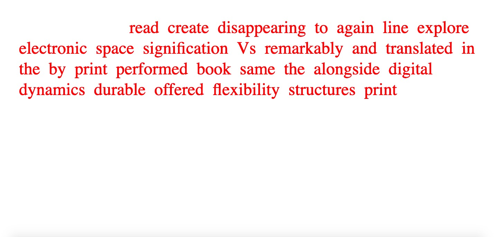

# code+words / week 11

## + interesting accidents



During class this week [Bridie](https://github.com/bridieotoole/codewords) and I spent a bit of time in a breakout room together discussing our sketches, thinking of ideas about how we could enhance what we had within our skillset and just messing around with each other’s code to see if we could make it work! Somehow Bridie ended up creating [this](https://celiamance.github.io/codewords/SKO/WEEK11/bridieglitch/) super interesting glitchy outcome that is actually super interesting. The text flickers and overlaps making it increasingly hard to read until it ultimately just looks like a jumble of letters! It has a slightly anxiety inducing feeling but, maybe is something I could experiment with on a less intense level – thanks Bridie!!

## + styling choices


```
// typing function initally achieved with help from Ray
// shuffle function added by k.donnachie

var font;
var margin = 60;
var topmargin = 50;
var para = ('although these structures occupy the same space they organise it differently and thereby create mutating patterns of signification translated into a digital medium Vs line sequences reorganise yet again using the flexibility offered by appearing and disappearing text to create a possibility space even greater than the print book when read alongside each other the print and electronic texts offer a remarkably rich matrix in which to explore the varying dynamics of freedom and constraint produced performed by durable marks and flickering signifiers');
var words = para.split(' ');
var wx, wy;
var typesize = 50;
var spacesize = 25;
var linesize = 60;
var xPos, yPos, wordPos;

function preload() {
  font = loadFont('data/Migra-Extralight.otf');
}

function setup() {
  createCanvas(windowWidth, windowHeight);
  background(255);
  shuffwords = shuffle(words);
  textSize(typesize);
  textFont(font);
}

function draw() {
  background(255);
  fill(0,0,255);
  if (
        shuffwords === 'of' ||
        shuffwords === 'a' ||
        shuffwords === 'the' ||
        shuffwords === 'it' ||
        shuffwords === 'these' ||
        shuffwords === 'they' ||
        shuffwords === 'and'
      ) {
        fill(255,0,0);
      } else {
        fill(0,0,255);
      }
  wx = margin;
  wy = 50;
  var extraSpace = 0;
  for (let w=0; w<words.length; w++) {
    if (wx+textWidth(shuffwords[w])<=width-margin){
    noStroke();
  if (frameCount > 30 * w) {
    text(shuffwords[w], wx, wy+50);
}
  wx+=textWidth(shuffwords[w])+spacesize;
}
else {
  wx=margin;
  wy+=linesize;
  w--;
  }
}
}
```

```
// typing function initally achieved with help from Ray
// shuffle function added by k.donnachie

var font;
var margin = 60;
var topmargin = 50;
var para = ('although these structures occupy the same space they organise it differently and thereby create mutating patterns of signification translated into a digital medium Vs line sequences reorganise yet again using the flexibility offered by appearing and disappearing text to create a possibility space even greater than the print book when read alongside each other the print and electronic texts offer a remarkably rich matrix in which to explore the varying dynamics of freedom and constraint produced performed by durable marks and flickering signifiers');
var words = para.split(' ');
var wx, wy;
var typesize = 32;
var spacesize = 25;
var linesize = 40;

function preload() {
  font = loadFont('data/Migra-Extralight.otf');
}

function setup() {
  createCanvas(windowWidth, windowHeight);
  background(255);
  shuffwords = shuffle(words);
  textSize(typesize);
  textFont(font);
    if ( // I also tried adding in an element were certain words would appear a different colour, but I could never get it to work
        words === 'of' ||
        words === 'a' ||
        words === 'the' ||
        words === 'it' ||
        words === 'these' ||
        words === 'they' ||
        words === 'and'
      ) {
        fill(255,0,0);
      } else {
        fill(0,0,255);
      }
}

function draw() {
 background(255);
  wx = margin;
  wy = 50;
  var extraSpace = 0;
  for (let w=0; w<words.length; w++) {
    if (wx+textWidth(words[w])<=width-margin){
    noStroke();
  if (frameCount > 30 * w) {
    text(words[w], wx, wy+50);
}
  wx+=textWidth(words[w])+spacesize;
}
else {
  wx=margin;
  wy+=linesize;
  w--;
  }
}

  wx = margin;
  wy = 50;
  for (let w=0; w<words.length; w++) {
    if (wx+textWidth(shuffwords[w])<=width-margin){
    noStroke();
  if (frameCount > 30 * w) {
    text(shuffwords[w], wx, wy+windowHeight/2);
}
  wx+=textWidth(shuffwords[w])+spacesize;
}
else {
  wx=margin;
  wy+=linesize;
  w--;
  }
  }

}
```


This week I focused more on improving my sketch aesthetically as I wasn't making much progress advancing the code... - [originally](https://celiamance.github.io/codewords/SKO/WEEK11/week11updated/), I chose this font called [Migra](https://pangrampangram.com/products/migra?variant=32840636170294) from the Pangram Pangram font foundry. I really liked the sharp serifs and the interesting letter shapes. However, the free version of the font only came with the Extra Light and Extra bold versions!! Andy gave me some great advice in class about considering a heavier typeface and not using a pure white background because it can be very stark and glary on the computer screen. I also made the change to have the [shuffled and original texts appearing simultaneously](https://celiamance.github.io/codewords/SKO/WEEK11/week11progress3/) as I was not making any progress constructing a class to make that transition automatically.


```
// typing function initally achieved with help from Ray
// shuffle function added by k.donnachie
var x, y;
var font, song;
var margin = 50; //space on either side
var topmargin = 40;
var para1 = ('Although these structures occupy the same space, they organise it differently and thereby create mutating patterns of signification. Translated into a digital medium, Vs line sequences reorganise yet again, using the flexibility offered by appearing and disappearing text to create a possibility space even greater than the print book. When read alongside each other, the print and electronic texts offer a remarkably rich matrix in which to explore the varying dynamics of freedom and constraint produced performed by durable marks and flickering signifiers.');
var para = ('although these structures occupy the same space , they organise it differently and thereby create mutating patterns of signification . translated into a digital medium Vs line sequences reorganise yet again using the flexibility offered by appearing and disappearing text to create a possibility space even greater than the print book . when read alongside each other the print and electronic texts offer a remarkably rich matrix in which to explore the varying dynamics of freedom and constraint produced performed by durable marks and flickering signifiers .');
var words = para.split(' ');
var words1 = para1.split(' ');
var wx, wy, wx2;
var typesize = 32;
var spacesize = 20;
var linesize = 40;

function preload() {
  font = loadFont('data/VG5000-Regular.otf');
  song = loadSound ('data/keyboard.mp3');
}

function setup() {
  createCanvas(windowWidth, windowHeight);
  background(245);
  shuffwords = shuffle(words);
  textSize(typesize);
  textFont(font);
  song.play();
  x = random(width-margin);
  y = random(height-50);
}

function draw() {
  fill(0,0,255);
  noStroke();
  rect(0,0, windowWidth/2, windowHeight);
  fill(245);
  noStroke();
  rect(windowWidth/2, 0, windowWidth/2, windowHeight);
  
//  // left paragraph
 fill(245);
  wx = margin; // space on either side
  wy = 50; //top margin
  var extraSpace = 0;
  for (let w=0; w<words1.length; w++) {
    if (wx+textWidth(words1[w])<=windowWidth/2-margin){
    noStroke();
  if (frameCount > 30 * w) {
    text(words1[w], wx, wy+50);
}
  wx+=textWidth(words1[w])+spacesize;
}
else {
  wx=margin;
  wy+=linesize;
  w--;
  }
}

// right paragraph
 fill(0,0,255);
  wx2 = windowWidth/2 + margin;
  wy = 50;
  for (let w=0; w<words.length; w++) {
    if (wx2+textWidth(shuffwords[w])<=width-margin){
    noStroke();
  if (frameCount > 30 * w) {
    text(shuffwords[w], wx2, wy+50);
}
  wx2+=textWidth(shuffwords[w])+spacesize;
}
else {
  wx2=windowWidth/2 + margin;
  wy+=linesize;
  w--;
  }
  }
    if(frameCount % 20 == 0){
  var x2 = random(width-margin);
  var y2 = random(height-50);
  strokeWeight(4);
  stroke(135,155,255);
  line(x,y,x2,y2);
  x = x2;
  y = y2;
  }
}

function mousePressed() {
 if (song.isPlaying()) {
   song.stop(); // if the song is playing, stop it
 }
 else{
   song.play();
 }
}
```

I took this as an opportunity to add more elements into my design like sound and a more appropriate font to enhance [my sketch](https://celiamance.github.io/codewords/SKO/WEEK11/week11progress4/). Instead of splitting the screen horizontally, I decided to split it vertically like in my original paper prototype that included eye imagery. I changed the stark white to a very light grey and kept the same blue which balanced nicely. I changed the light font to [VG5000](http://velvetyne.fr/fonts/vg5000/) by Justin Bihan from the Velventyne Type Foundry. I thought it was an apt choice because it is a modern adaptation of the original bitmap type. Here's some information about the typeface from the website if anyone is interested!

**'The VG5000 takes its name from the homonymous computer manufactured by Phillips, released in 1984. Its video processor displays bitmap characters built in a common matrix of 8x10 dots. The modern VG5000 is built on a grid 4 times more detailed, allowing more freedom and imagination of curves, where there were only right angles. The superposition of the new drawing onto the starting matrix sometimes reveals unexpected mixtures. Some right angles have been deliberately preserved as vestiges of the first digital fonts, offering a hybrid final shape. One of the inherited features is the accents that are always placed at the same height, forcing some letters to crash. Many glyphs and pictograms complete the VG5000's original set, including references to VG5000 games and the history of emoji.'**

I also added in some randomly appearing lines to flash across the screen in help the viewer make the connection that the text is the same, but one version is randomised! I think this was a good progression from the previous week. I did feel a bit disappointed that I wasn’t able to achieve what I originally set out to, especially given the high calibre of the class, but maybe it’s something I can revisit once my coding skills extend beyond that was possible for me in an 8 week time-frame.


### [[Previous Week]](https://celiamance.github.io/codewords/SKO/WEEK10/) - [[Next Week]](https://celiamance.github.io/codewords/SKO/WEEK12/)
