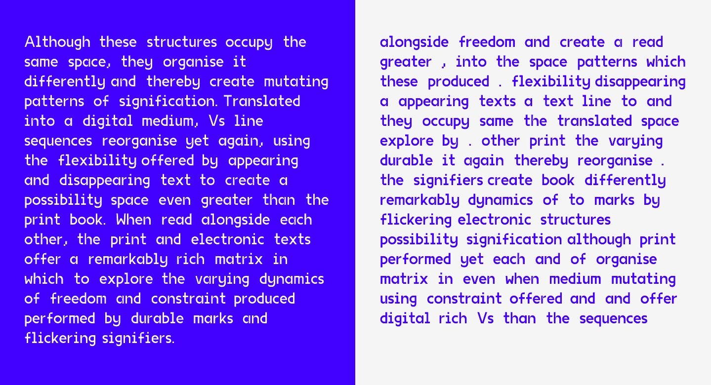

# code+words / week 11

## + styling choices

This week I focused more on improving my sketch aesthetically as I wasn't making much progress advancing the code... - [originally](https://celiamance.github.io/codewords/SKO/WEEK11/week11updated/), I chose this font called [Migra](https://pangrampangram.com/products/migra?variant=32840636170294) from the Pangram Pangram font foundry. I really liked the sharp serifs and the interesting letter shapes. However, the free version of the font only came with the Extra Light and Extra bold versions!! Andy gave me some great advice in class about considering a heavier typeface and not using a pure white background because it can be very stark and glary on the computer screen. I also made the change to have the [shuffled and original texts appearing simultaneously](https://celiamance.github.io/codewords/SKO/WEEK11/week11progress3/) as I was not making any progress constructing a class to make that transition automatically.

I took this as an opportunity to add more elements into my design like sound and a more appropriate font to enhance [my sketch](https://celiamance.github.io/codewords/SKO/WEEK11/week11progress4/). Instead of splitting the screen horizontally, I decided to split it vertically like in my original paper prototype that included eye imagery. I changed the stark white to a very light grey and kept the same blue which balanced nicely. I changed the light font to [VG5000](http://velvetyne.fr/fonts/vg5000/) by Justin Bihan from the Velventyne Type Foundry. I thought it was an apt choice because it is a modern adaptation of the original bitmap type. Here's some information about the typeface from the website if anyone is interested!

**'The VG5000 takes its name from the homonymous computer manufactured by Phillips, released in 1984. Its video processor displays bitmap characters built in a common matrix of 8x10 dots. The modern VG5000 is built on a grid 4 times more detailed, allowing more freedom and imagination of curves, where there were only right angles. The superposition of the new drawing onto the starting matrix sometimes reveals unexpected mixtures. Some right angles have been deliberately preserved as vestiges of the first digital fonts, offering a hybrid final shape. One of the inherited features is the accents that are always placed at the same height, forcing some letters to crash. Many glyphs and pictograms complete the VG5000's original set, including references to VG5000 games and the history of emoji.'**

I also added in some randomly appearing lines to flash across the screen in help the viewer make the connection that the text is the same, but one version is randomised! I think this was a good progression from the previous week. I did feel a bit disappointed that I wasn’t able to achieve what I originally set out to, especially given the high calibre of the class, but maybe it’s something I can revisit once my coding skills extend beyond that was possible for me in an 8 week time-frame.

### [[Previous Week]](https://celiamance.github.io/codewords/SKO/WEEK10/) - [[Next Week]](https://celiamance.github.io/codewords/SKO/WEEK12/)
