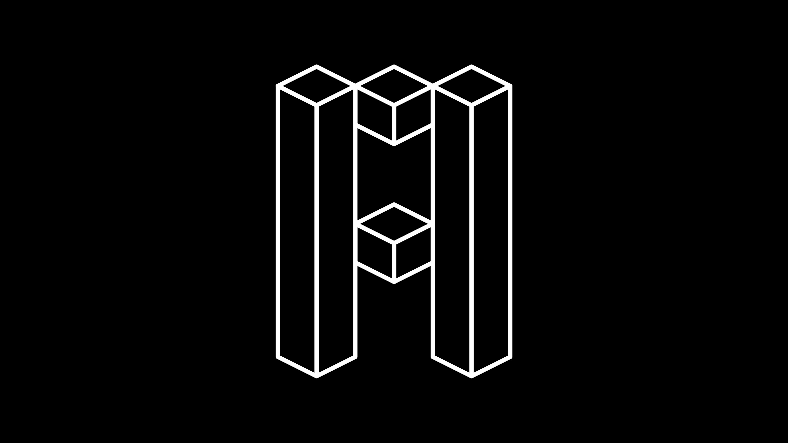
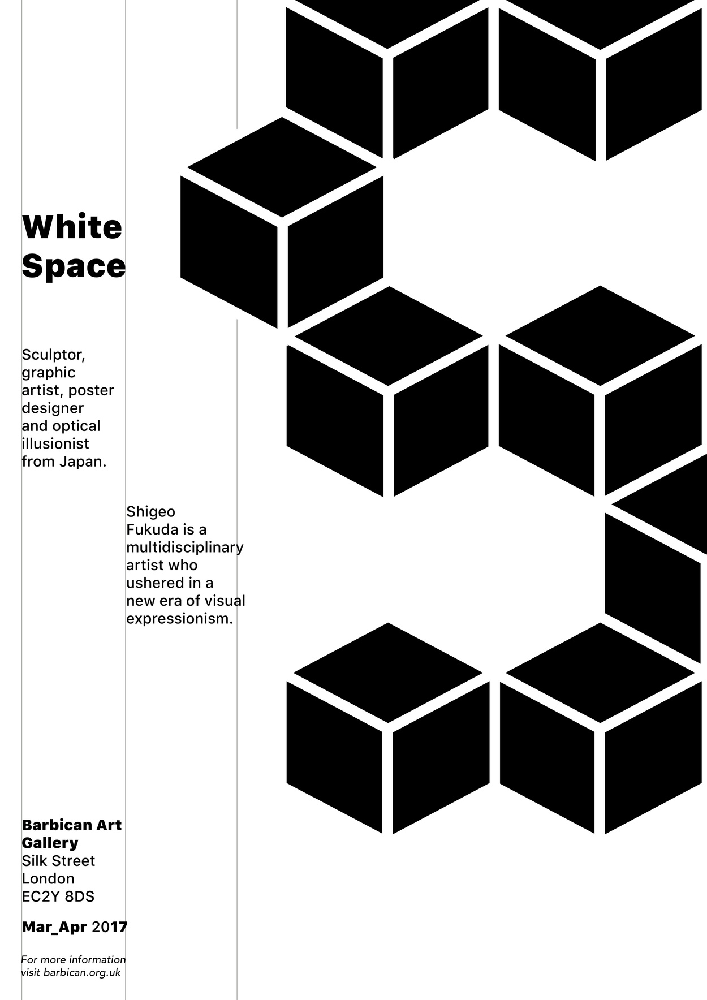
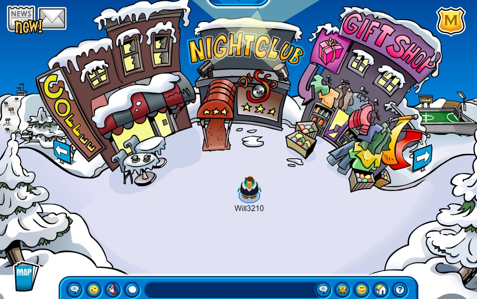
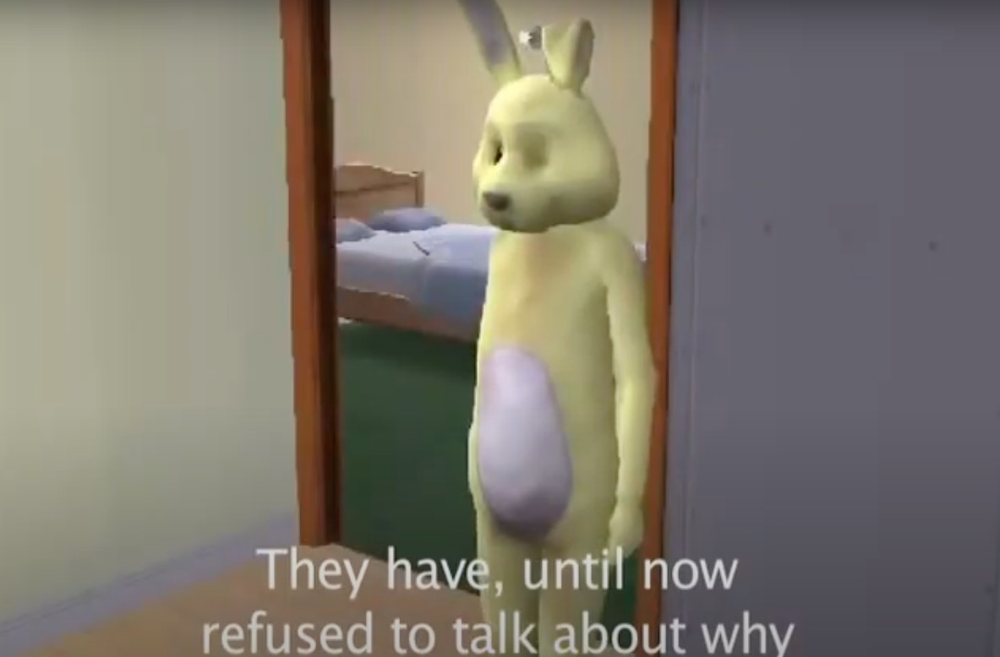
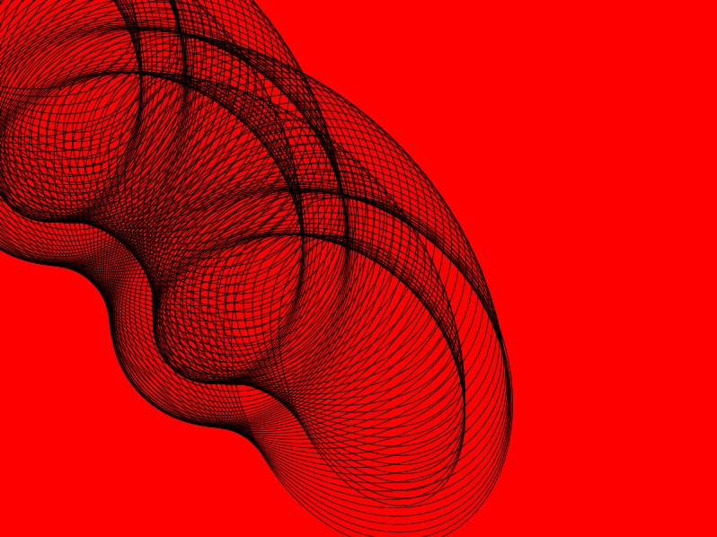

# code+words / week 2

## + modular typography




To commence our second week we started by learning about and researching modular typography. One example that I found was by [Kelvin Ha](https://kelvinha.com/Modular-Type). He describes this ‘modular type project’ as a concept ‘based on illusion and negative space’ inspired by ‘the theory and practice of Japanese sculptor, medallist, graphic artist and poster designer, Shigeo Fukuda’. Fukuda’s influence is evident in Ha’s manipulation of form and colour to distort perspective as ‘the alphabet can be 2D or 3D depending on the viewer’s’ optical emphasis.

You can find the other examples the class found on [these slides](https://docs.google.com/presentation/d/1N2hAFp6si7UsVuPj1oMQ21_HHF858NbXZna0YQxOQio/edit#slide=id.p).


## + starting assignment 2



We also started to look at assignment 2 this week, our House of Leaves virtual rereading. My group, Ruby, Hamish, Fergus, and I, decided to select the virtual world of Club Penguin. It will be interesting to see how we are about to link the slightly erratic narrative and disorienting structure of House of Leaves with a game as innocent as Club Penguin.



Andy showed us a couple of examples of narratives told through digital worlds, including [this one](https://www.youtube.com/watch?v=Tn9wVdaMOlw) called The Pooka which is equally terrifying and nostalgic for me having played a lot of sims as a child.


## + more processing



```
var movement=0;
var angleRotation=0;
function setup() {
createCanvas (800,600);
background (255,0,0);
stroke(0); //the colour of the stroke
strokeWeight(5); //the line thickness
//line (100,100,400,400);
frameRate(10);
}

function draw() {
 strokeWeight(1);
 noFill();
 //fill (mouseX/2,(mouseX+mouseY)/4,mouseY/2);
 //fill(255,0,0,5); //rectangle with alpha transparency
 //rect (0,0,500,500); //rect(x1,y1,width, height)
 angleMode(DEGREES);
 translate (movement, movement);
 //movement++;//auto-move by one pixel diagonally
 //movement++;//this doubles the previous line
 movement+=5;
 
 //translate(250+mouseY/10, 250+mouseY/10); //mouse control here
 //rotate(mouseX-180); //mouse control here
 angleRotation+=5;
 rotate (angleRotation);
 noFill();
 //fill ((mouseX+mouseY)/4,255-mouseX/2,255-mouseY/2);
 ellipse (0,0,300,400); //(centre x, centre y, width, height)
 //fill(0);
 noFill();
 ellipse (0,0,190,310);
 noFill();
 //triangle(250,250,mouseX,mouseY,pmouseX,pmouseY); //(x1,y1,x2,y2,x3,y3)
 //line (mouseX, mouseY, pmouseX, pmouseY);
if (movement>=500){
   background(255,0,0);
   movement=0;
 }
}
function keyPressed (){
  rotate(0);
  translate(0,0);
  background(255,0,0);
 
}
```

For our second processing tutorial in week 2 we made this ['nearly spirograph'](https://celiamance.github.io/codewords/SKO/WEEK2/nearly_spirograph/) to explore rotation and translating fuctions. This was the perfect intoduction to learn how to animate sketches rather than just creating static shapes.


## + github

We were also introduced to the weird and wonderful world of GitHub this week - a platform I had actually never heard of! Initially, I found it quite difficult to navigate and didn't understand how to use markdown at all, but the information from [this page](https://guides.github.com/features/mastering-markdown/) and Andy's tutorials were really helpful to help me to get started.

Like in first year using Tumblr, GitHub will be a great resource to be able to look at other people's progress and be inspired by the projects they find and document. I think this public facing version of an SKO is really beneficial to be able to learn from other students' work and the behind the scenes progress that you would never normally see, especially given the current online delivery of uni.


### [[Previous Week]](https://celiamance.github.io/codewords/SKO/WEEK1/) - [[Next Week]](https://celiamance.github.io/codewords/SKO/WEEK3/)
