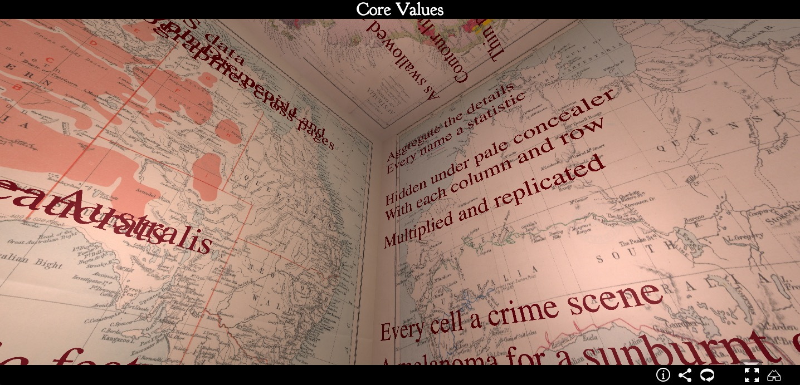
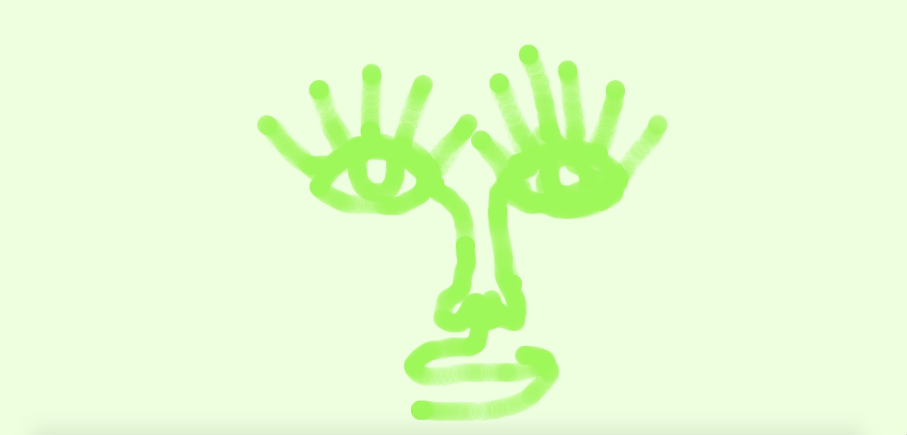

# code+words / week 3

## + electronic literature


During our third class we began looking at the scope of work that fits into the category of electronic literature, including chat bots, live coding performance, generative texts/ novels, animated words and motion typography. Part of this exploration was trying out [AI Dungeon](https://play.aidungeon.io/main/landing) as a class which somehow ended in a catastrophic loop of the universe collapsing repeatedly. Other examples we found were not so apocalyptic! Another classmate found this AI generated typeface, [‘Obsolete’](https://www.barneymccann.com/obsolete) by Barney McCann that uses algorithmic devices to produce computer-made letterforms that morph from one form to another in the most efficient way possible. McCann states that “I think this is the closest you can get to a computer’s handwriting.” I think this project is an interesting way of showing the possibilities of designers working with code to produce something they could potentially design themselves but with an exponentially faster output and learning system to improve upon what has already been made. Rather than viewing code as something that can replace designers, it can be viewed as a collaborative process.



After class I found an example of digital poetry, [Core Values](https://poetry.codetext.net/core-values/) by [Benjamin Laird](https://bl.id.au/), a PhD candidate at RMIT. They wrote Core Values in response to Dorothea Mackellar’s poem, [My Country](https://www.dorotheamackellar.com.au/archive/mycountry.htm). The poem, Core Values, is displayed fragmented and animated in a box made from maps of Australia. The format is intended to make the viewer feel claustrophobic, a juxtaposition to the idyllic ‘land of sweeping plains’ Mackellar describes.
Having studied My Country in primary school, I remember it fondly, but it definitely perpetuates a romanticised perspective of Australian history that is criticized in Laird’s poem. Laird's use of code to display their poem effectively enhances the intended trapped feeling, exemplifying that combining code with literature transforms a passive text to something performative and more visually engaging.


## + assignment 2 progress

We continued planning our second assignment, Rereadings in Club Penguin using [this google doc](https://docs.google.com/document/d/1DJS7c56zpp8Y9cg9a4pRmUciNNnArXs8-nFGbDVTeqk/edit) to collate our ideas and work on scripting the dialogue/ scenes.


## + sketch of the week



```
function setup() {
createCanvas(windowWidth, windowHeight);
background(241,253,224);
}


function draw() {
noStroke();
fill(181,235,90,50);
ellipse(mouseX, mouseY, 30, 30);
}

function mousePressed(){
background(241,253,224);
}
```

Following [this Dan Shiffman tutorial](https://www.youtube.com/watch?v=RnS0YNuLfQQ&list=PLRqwX-V7Uu6Zy51Q-x9tMWIv9cueOFTFA&index=8) I made a [simple drawing sketch](https://celiamance.github.io/codewords/SKO/WEEK3/whiteboard/) that refreshes using the mouse pressed function. I have really been enjoying going through his tutorials - they are super fun and easy to follow! I made this strange face and had fun trying to draw different things!


### [[Previous Week]](https://celiamance.github.io/codewords/SKO/WEEK2/) - [[Next Week]](https://celiamance.github.io/codewords/SKO/WEEK4/)
