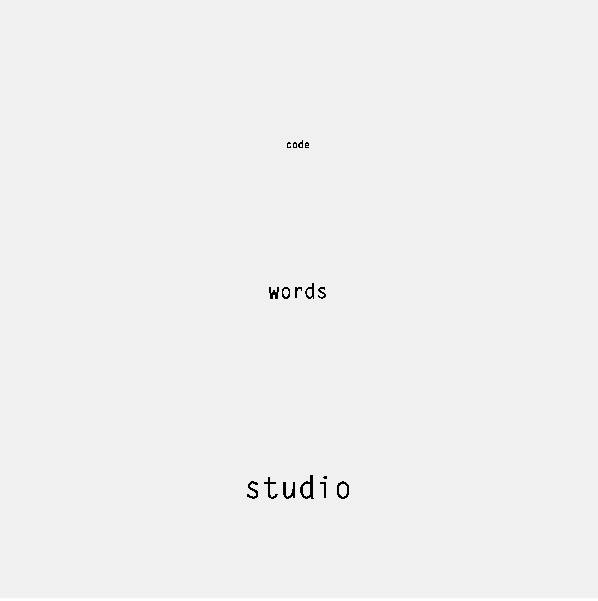
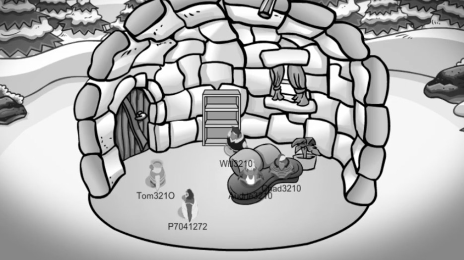

# code+words / week 4

## + more processing

To begin our fourth week of class we started with another power hour of code with Karen. We learnt how to upload fonts onto Processing using the preload() function and how to code text to change the size, position and to animate it. Our [second type test](https://celiamance.github.io/codewords/SKO/WEEK4/type_test2) involved using mouseX and mouseY functions again, making it a engaging, interactive outcome.

## + assignment 2 continued

Out group also met up via FaceTime quite a few times throughout the past few weeks to organise and record our Club Penguin rereading. We also worked on editing our allocated sections of the video.
