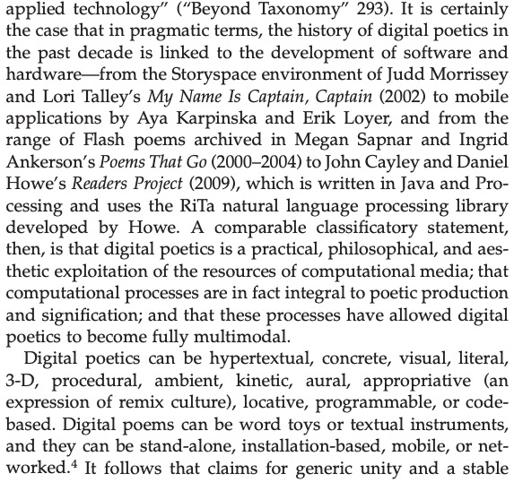

# code+words / week 5

## + assignment 2 rereadings

[Our group outcome](https://youtu.be/hxVLtIr6eNs)
During todays class we shared the outcomes of our group assignment, rereading The House of Leaves. Everyone had produced such amazing work and really embraced all the elements their virual world had to offer. 

## + major project research

Once we had submitted our assignment this week I began focusing more on our major task. I started by going through some readings that I thought I might be interested in, such as ‘“Living Letterforms”: The Ecological Turn in Contemporary Digital Poetics’ by Rita Raley. While I wasn’t engrossed by the overall text, there were some interesting examples of digital poetry that Raley mentions, including [‘The Readers Project’](http://thereadersproject.org/index.html) by John Cayley and Daniel Howe. They describe the project as ‘a collection of distributed, performative, quasi-autonomous poetic 'readers' — active, procedural entities with distinct reading behaviours and strategies.’ Each reader’s path focuses on specific linguistic elements and is shown through the use of colour and words highlighting and fading. 

‘Generally speaking, the readers… are driven by processes coded to perform reading behaviours that are meaning-generative, at least in so far as they relate to an aesthetics of human reading while also, perhaps, challenging our reading to embrace and comprehend expressive process.’ 

I found this work especially interesting as it is able to use code to illustrate the subconscious and normally unseen process of reading, and not necessarily human reading at that. This project made me consider the way that humans read, reflecting on my own tendencies to skip to sections spoken text during a dramatic part of the plot, but then going back to the top of the page to read bits of description that I missed. I also tend to find it more difficult to concentrate reading from my computer than from a book or printed pages. I wondered if the structure of digital text was presented differently, would I still read this way or still find it more difficult that reading a physical copy? While reading from left to right on a printed page with each line having about 9-11 words is the norm for Western novels, this structure is primarily for efficiency of space while ensuring legibility to reduce cost for printed books. In the digital space where materials are unlimited, is there a more effective way of displaying text to ensure greater understanding or allow for faster reading?

### [[Previous Week]](https://celiamance.github.io/codewords/SKO/WEEK4/) - [[Next Week]](https://celiamance.github.io/codewords/SKO/WEEK6/)
