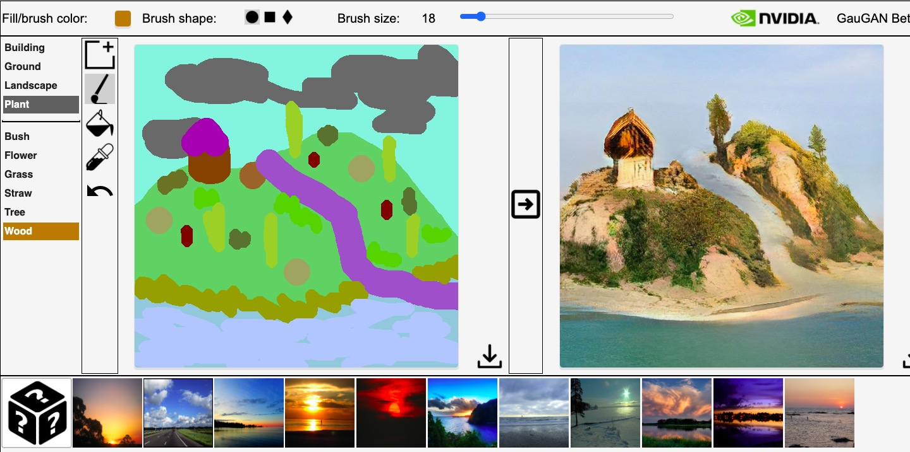

# code+words / week 5

## + assignment 2 rereadings and reflection

[Our group outcome](https://youtu.be/hxVLtIr6eNs)

During today’s class we shared the outcomes of our group assignment, rereading The House of Leaves. Everyone had produced such amazing work and really embraced all the elements their virtual world had to offer. I really loved the outcome of the Second Life group. The platform has just the right blend of realism and fantasy to create a strange dichotomy that paired perfectly with the novel as an example of ergodic literature.

When we first approached this task, my group and I initially struggled to link the slightly erratic narrative and disorienting structure of House of Leaves with a game as innocent as Club Penguin. However, we were able to identify key settings and feelings evident in our chapter that could be represented in the virtual world. To compensate for the limited customisation in the game, especially to represent specific events in the novel, we decided to use the minigames in Club Penguin to further communicate various themes and emotions occurring in the text. Another limitation that we overcame was the inability to film from different camera angles given the stationary perspective of the game. We used zooming and panning effects in post-production to combat this. We also wanted to clearly differentiate between the perspectives of Johnny Truant and Zampano, achieved by using different fonts in the book. We decided to distinguish them by switching between colour and black and white footage, as well as using different text to speech narrators for their voice overs.

## + major project research

Once we had submitted our assignment this week I began focusing more on our major task. I started by going through some readings that I thought I might be interested in, such as ‘“Living Letterforms”: The Ecological Turn in Contemporary Digital Poetics’ by Rita Raley. While I wasn’t engrossed by the overall text, there were some interesting examples of digital poetry that Raley mentions, including [‘The Readers Project’](http://thereadersproject.org/index.html) by John Cayley and Daniel Howe. They describe the project as ‘a collection of distributed, performative, quasi-autonomous poetic 'readers' — active, procedural entities with distinct reading behaviours and strategies.’ Each reader’s path focuses on specific linguistic elements and is shown through the use of colour and words highlighting and fading. 

‘Generally speaking, the readers… are driven by processes coded to perform reading behaviours that are meaning-generative, at least in so far as they relate to an aesthetics of human reading while also, perhaps, challenging our reading to embrace and comprehend expressive process.’ 

I found this work especially interesting as it is able to use code to illustrate the subconscious and normally unseen process of reading, and not necessarily human reading at that. This project made me consider the way that humans read, reflecting on my own tendencies to skip to sections spoken text during a dramatic part of the plot, but then going back to the top of the page to read bits of description that I missed. I also tend to find it more difficult to concentrate reading from my computer than from a book or printed pages. I wondered if the structure of digital text was presented differently, would I still read this way or still find it more difficult that reading a physical copy? While reading from left to right on a printed page with each line having about 9-11 words is the norm for Western novels, this structure is primarily for efficiency of space while ensuring legibility to reduce cost for printed books. In the digital space where materials are unlimited, is there a more effective way of displaying text to ensure greater understanding or allow for faster reading?

## + AI in action

http://nvidia-research-mingyuliu.com/gaugan/

While researching online I found this really cool example of AI, a website that generates realistic images of a landscape that you draw! Mine turned out a bit strange looking, but I’ve seen some really realistic ones online!! It was a super fun tool to play with and I recommend you have a go.

### [[Previous Week]](https://celiamance.github.io/codewords/SKO/WEEK4/) - [[Next Week]](https://celiamance.github.io/codewords/SKO/WEEK6/)
