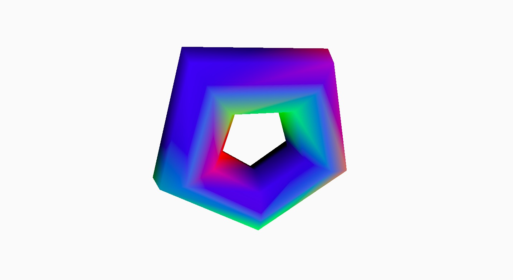

# code+words / week 6

## + major project research 2

While I had enjoyed parts of the various readings that I had been through, I was still unsure about making a definitive choice and identifying a specific section from a text to use. I read ‘Technotexts’ by N. Katherine Hayles and enjoyed it, so I read all of the other N. Katherine Hayles texts to see if there were others that expressed similar sentiments in a more elaborated form. Some parts I liked from ‘Technotexts’ included how Hayles examined how ‘the physical form of the literary artifact [will] always affect what the words (and other semiotic components) mean’. This related to the ideas I had thought of last week while researching ‘The Readers Project’ and made me consider the specific elements of the way you design text to alter one’s interpretation. 

By reading the other N. Katherine Hayles texts, I found that ‘The Time of Digital Poetry: From Object to Event’ explored similar ideas. ‘In addition to considering the effects of the words, this author must also decide the background on which the words will appear, the behaviours that will attach to it, the colour, size, and type of font in which it will appear, whether it will have links anchored to it or not, and a host of other factors that the digital medium makes possible.’ From this list of variables, I have considered a few ways to convey the meaning of text; the placement and movement of text, structuring a game around text, the speed and clarity that text appears on the screen or using hyperlinks to move through a text. The design of digital text makes the experience of interacting with it more of ‘a process rather than an object’. This difference is differentiated by the seperate ‘production’ of print in comparison to the ‘performance’ of digital text ‘in a more kinaesthetically complex and vivid sense’. This effective interaction between code and digital literacy something that I hope to achieve through my own exploration.

## + sketch of the week

While looking through the [p5.js examples page](https://p5js.org/examples/), I came across [this example](https://p5js.org/examples/3d-geometries.html) using WEBGL. I really liked the outcome and had a bit of a play with some of the functions. I particularly liked the torus shape and made a couple of simple adjustments to make [this sketch](https://celiamance.github.io/codewords/SKO/WEEK6/torus3d/). While This particular function may not end up being related to my major assignment, I had fun nonetheless!
