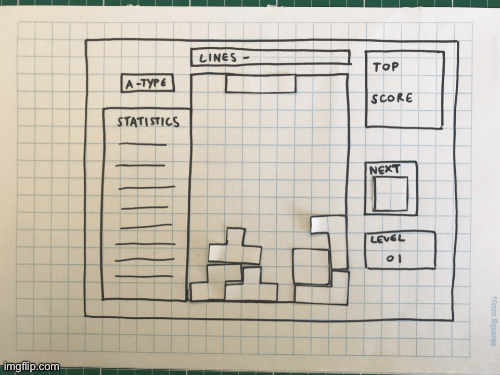
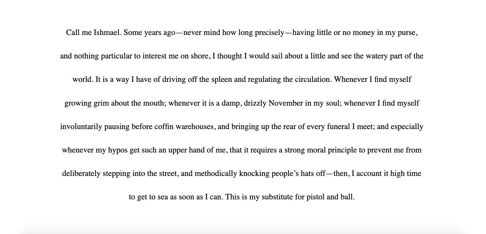
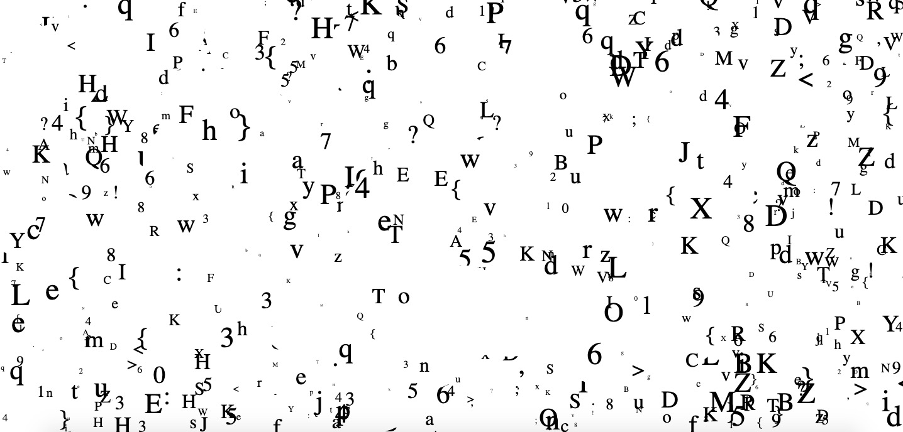

# code+words / week 6

## + paper prototypes



During this weeks class we were introduced to paper prototyping and started creating a paper model of a retro game - my group and I chose to do tetris! This is a great intermediate step before having a go at constructing code. It allows you to visualise how your idea will function and provides an easily accessible way to describe it to others alongside a physical representation. While our ideas seem obvious and realised in our minds it is far harder for others to understand what you mean based on an intangible thought.

## + major project research 2

While I had enjoyed parts of the various readings that I had been through, I was still unsure about making a definitive choice and identifying a specific section from a text to use. I read ‘Technotexts’ by N. Katherine Hayles and enjoyed it, so I read all of the other N. Katherine Hayles texts to see if there were others that expressed similar sentiments in a more elaborated form. Some parts I liked from ‘Technotexts’ included how Hayles examined how ‘the physical form of the literary artifact [will] always affect what the words (and other semiotic components) mean’. This related to the ideas I had thought of last week while researching ‘The Readers Project’ and made me consider the specific elements of the way you design text to alter one’s interpretation. 

By reading the other N. Katherine Hayles texts, I found that ‘The Time of Digital Poetry: From Object to Event’ explored similar ideas. ‘In addition to considering the effects of the words, this author must also decide the background on which the words will appear, the behaviours that will attach to it, the colour, size, and type of font in which it will appear, whether it will have links anchored to it or not, and a host of other factors that the digital medium makes possible.’ From this list of variables, I have considered a few ways to convey the meaning of text; the placement and movement of text, structuring a game around text, the speed and clarity that text appears on the screen or using hyperlinks to move through a text. The design of digital text makes the experience of interacting with it more of ‘a process rather than an object’. This difference is differentiated by the seperate ‘production’ of print in comparison to the ‘performance’ of digital text ‘in a more kinaesthetically complex and vivid sense’. This effective interaction between code and digital literacy something that I hope to achieve through my own exploration.

## + working with blocks of text



```
//working with midform text
var myText= "Call me Ishmael. Some years ago—never mind how long precisely—having little or no money in my purse, and nothing particular to interest me on shore, I thought I would sail about a little and see the watery part of the world. It is a way I have of driving off the spleen and regulating the circulation. Whenever I find myself growing grim about the mouth; whenever it is a damp, drizzly November in my soul; whenever I find myself involuntarily pausing before coffin warehouses, and bringing up the rear of every funeral I meet; and especially whenever my hypos get such an upper hand of me, that it requires a strong moral principle to prevent me from deliberately stepping into the street, and methodically knocking people’s hats off—then, I account it high time to get to sea as soon as I can. This is my substitute for pistol and ball.";

function setup() {
createCanvas(windowWidth, windowHeight);
background(255);
textSize(24);
noStroke();
textFont("Times");
textAlign(CENTER);
fill(0);
}


function draw() {
background(255);
//textLeading(sin(frameCount*0.01)*50);
textLeading(mouseY/5);
text(myText, int(windowWidth/8), windowHeight/8, int(windowWidth/4*3), windowHeight);
}
```
During this week’s power hour of code with Karen we learnt how to print blocks of text in this sketch. This will be a really helpful tool for creating future sketches to amplify the ‘words’ section of ‘codewords’ and to integrate more of our selected texts in our major project.


## + random function



This week was a busy coding week! We also created [this sketch](https://celiamance.github.io/codewords/SKO/WEEK6/whiteboard_letters/) in class using the random function to make different letters appear in varying sizes across the canvas. Karen also added in a neat white brush tool like a whiteboard to erase some of the letters that were popping up!

## + sketch of the week


```
function setup() {
  createCanvas(windowWidth, windowHeight, WEBGL);
}

function draw() {
  background(250);
  normalMaterial();
  push();
  rotateZ(frameCount * 0.005);
  rotateX(frameCount * 0.005);
  rotateY(frameCount * 0.005);
  torus(200, 100, 5, 8);
  pop();
}
```

While looking through the [p5.js examples page](https://p5js.org/examples/), I came across [this example](https://p5js.org/examples/3d-geometries.html) using WEBGL. I really liked the outcome and had a bit of a play with some of the functions. I particularly liked the torus shape and made a couple of simple adjustments to make [this sketch](https://celiamance.github.io/codewords/SKO/WEEK6/torus3d/). While this particular function may not end up being related to my major assignment, I had fun nonetheless!


### [[Previous Week]](https://celiamance.github.io/codewords/SKO/WEEK5/) - [[Next Week]](https://celiamance.github.io/codewords/SKO/WEEK7/)
