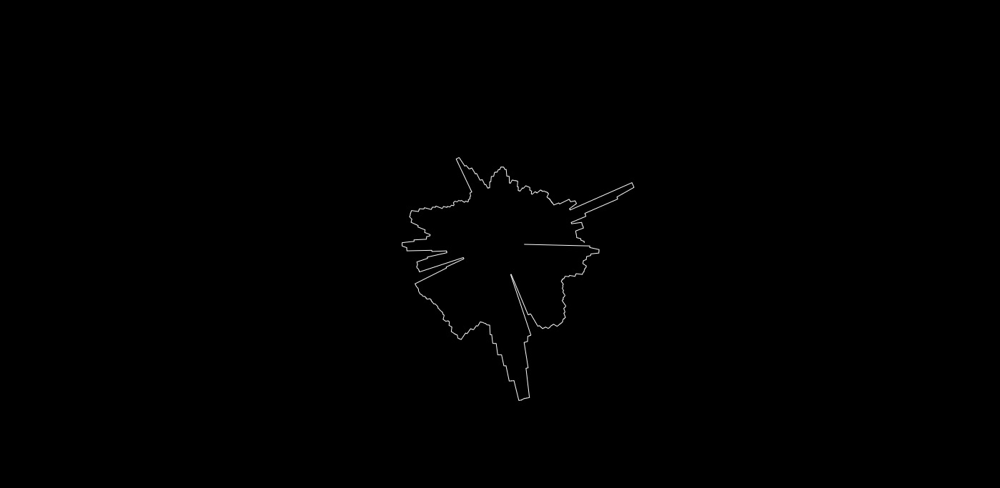

# code+words / midsem break & week 7

## + major project research

During midsem break I wanted to commit a lot of time to developing my major project idea. To do this, I immersed myself in the world of electronic literature. I was immediately surprised by how popular this seemingly niche topic is and how long people have been involved in it, finding projects from the 90s and early 2000s. 


[‘The Dream Life of Letters’](https://collection.eliterature.org/1/works/stefans__the_dreamlife_of_letters.html) by Brian Kim Stefans cleverly uses animation to visualise different words in alphabetical order. Stefans describes it as a project ‘based on a text by Rachel Blau DuPlessis, that attempts to explore the ground between classic concrete poetry, avant-garde feminist practice, and "ambient" poetics.’ I really like the animations create a captivating visual and somewhat reference the meaning or connotations of the word.

Watch it [here](https://www.youtube.com/watch?v=ZSnq0nMAQQc).


[‘Whispering Galleries’](https://www.whisperinggalleries.com/) by Amaranth Borsuk and Brad Bouse ‘is an interactive digital artwork that uses the Leap Motion gestural controller to allow visitors to interact with a historical diary.’ By tracking the user’s hand movements, the work transforms to reveal poems constructed from the original text in the anonymous 1858 diary. I really loved the interaction with this work that does not rely on physically typing or concrete actions, but rather a more gentle, detached movement from your ‘digital body’.

Watch an interview with the creaters [here](https://vimeo.com/104981357).


[‘Networked Optimization’](https://silviolorusso.com/work/networked-optimization/) by Silvio Lorusso & Sebastian Schmieg showcases ‘crowdsourced versions of popular self-help books’. The only text visible on the page ‘is the so-called popular highlights – the passages that were underlined by many Kindle users – together with the amount of highlighters. Each time a passage is underlined, it is automatically stored in Amazon’s data centers.’ Only the most commonly valuable and impactful text remains creating a ‘highlight-reel’ of the most poignant parts of each book. I find this work to be fascinating, especially because it employs existing data and contains it in a physical format.


## + sharing ideas

In small groups we presented our paper prototypes for our major projects. I was in a group with Win and Hamish and it was really good to see what they had come up with. This kind of collaborative feedback from fellow students is always helpful and it's so nice to actually see people's faces in the class haha. They both provided me with some great advice about how to develop the ideas I had started with and gave me way more confidence that the ideas I had come up with had real potential. 


## + sketch of the week



```
var song;
var amp;
var button; 
var volhistory = [];

function preload() {
   song = loadSound('data/jazz.mp3');
}

function setup() {
  createCanvas(windowWidth, windowHeight);
  song.play();
  amp = new p5.Amplitude();
  angleMode (DEGREES);
}

function draw() {
  background (0);  
  fill(255);
  noStroke();
  var vol = amp.getLevel();
  volhistory.push(vol);
  stroke(255);
  noFill();
   
 translate(width/2, height/2);
    beginShape();
  for (var i = 0; i < 360; i++) {
    var r = map(volhistory[i]*10, 0, 1, 10, 100);
    var x = r * cos(i);
    var y = r * sin(i);
    vertex(x, y);
  }
  endShape();
  
  
 // beginShape();
 // for (var i = 0; i <volhistory.length; i++) {
 //   var y = map(volhistory[i], 0, 1, height, 0);
 //  vertex(i, y); 
 // }
 // endShape();
  //ellipse(windowWidth/2, windowHeight/2, windowWidth, vol*1300);
if (volhistory.length > 360) {
 volhistory.splice(0, 1);
}
}

function keyPressed() {
 if (song.isPlaying()){
   song.pause();
 }

 else{
   song.play();
 }
}
```

Following Karen's tutorial about adding in the p5.js sound library, I watched some more The Coding Train video to cement my knowledge.
I followed [this tutorial](https://www.youtube.com/watch?v=h_aTgOl9J5I&list=PLRqwX-V7Uu6aFcVjlDAkkGIixw70s7jpW&index=10&ab_channel=TheCodingTrain) and made my [own radial volume graph](https://celiamance.github.io/codewords/SKO/WEEK7/testingsongcircle) to a jazz song. The outcome was stangely hypnotic and calming - I really enjoyed making it!


## + university cuts

```
Karen's Code
#include <australianUniversities.h>
#include <HEstaff.h>
#include <NTEU.h>
#include <students.h> 

void fightTheCuts() {
  while (cuts > 0) {
    resist ();
    print (“Fight The Cuts!”);
    protest++; 
    discuss();
  }
  print (“university belongs to all Australians”);
} 
```
Taken from [Bridie O'Toole's github](https://github.com/bridieotoole/codewords/blob/master/week_07/readme.md)

At the end of the session we spoke about the severe cuts staff are facing at RMIT. This chat really helped me understand the severity of the issue with 35 librarians being terminated and entire faculties gone. I was somewhat previously aware of the issue and had incidentally had a chat with my photography teacher about it the week before, but hearing these numbers was a shock. Not only is it devastating for the staff, but it also provides a threat to the quality of education that we as students receive - many opportunities will no longer be available once we return to physical classes, including the make-a-space.


### [[Previous Week]](https://celiamance.github.io/codewords/SKO/WEEK6/) - [[Next Week]](https://celiamance.github.io/codewords/SKO/WEEK8/)
