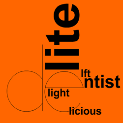
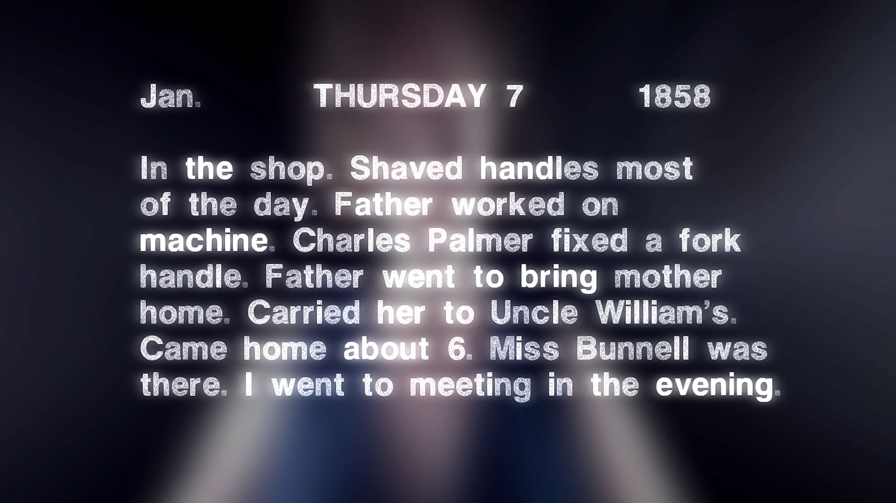
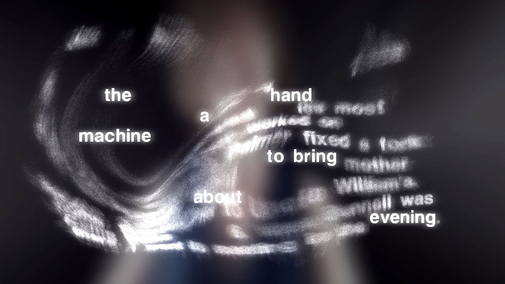
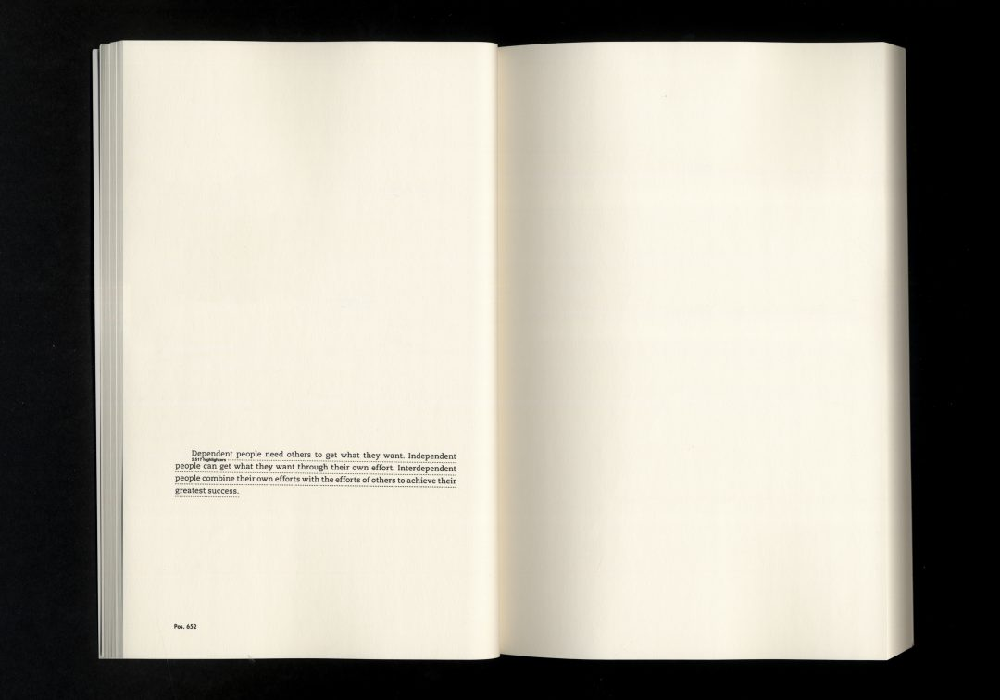

# code+words / midsem break & week 7

## + major project research

During midsem break I wanted to commit a lot of time to developing my major project idea. To do this, I immersed myself in the world of electronic literature. I was immediately surprised by how popular this seemingly niche topic is and how long people have been involved in it, finding projects from the 90s and early 2000s. 

[‘The Dream Life of Letters’](https://collection.eliterature.org/1/works/stefans__the_dreamlife_of_letters.html) by Brian Kim Stefans cleverly uses animation to visualise different words in alphabetical order. Stefans describes it as a project ‘based on a text by Rachel Blau DuPlessis, that attempts to explore the ground between classic concrete poetry, avant-garde feminist practice, and "ambient" poetics.’ I really like the animations create a captivating visual and somewhat reference the meaning or connotations of the word.

Watch it [here](https://www.youtube.com/watch?v=ZSnq0nMAQQc).

[‘Whispering Galleries’](https://www.whisperinggalleries.com/) by Amaranth Borsuk and Brad Bouse ‘is an interactive digital artwork that uses the Leap Motion gestural controller to allow visitors to interact with a historical diary.’ By tracking the user’s hand movements, the work transforms to reveal poems constructed from the original text in the anonymous 1858 diary. I really loved the interaction with this work that does not rely on physically typing or concrete actions, but rather a more gentle, detached movement from your ‘digital body’.

Watch an interview with the creaters [here](https://vimeo.com/104981357).

[‘Networked Optimization’](https://silviolorusso.com/work/networked-optimization/) by Silvio Lorusso & Sebastian Schmieg showcases ‘crowdsourced versions of popular self-help books’. The only text visible on the page ‘is the so-called popular highlights – the passages that were underlined by many Kindle users – together with the amount of highlighters. Each time a passage is underlined, it is automatically stored in Amazon’s data centers.’ Only the most commonly valuable and impactful text remains creating a ‘highlight-reel’ of the most poignant parts of each book. I find this work to be fascinating, especially because it employs existing data and contains it in a physical format.

