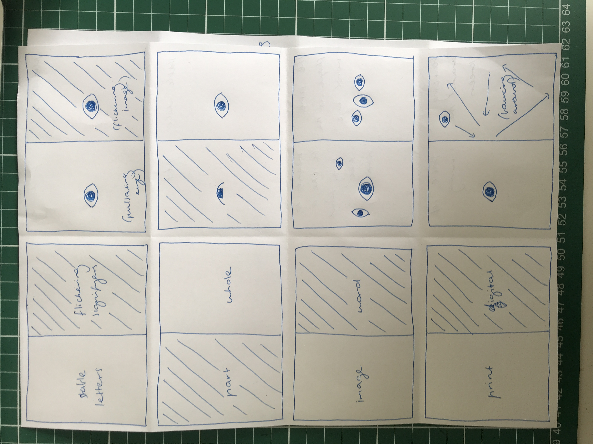
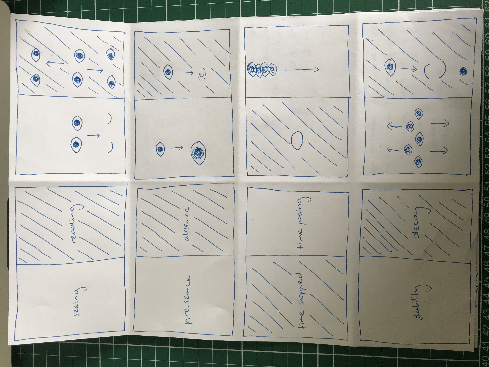
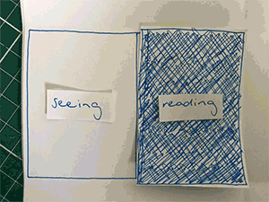
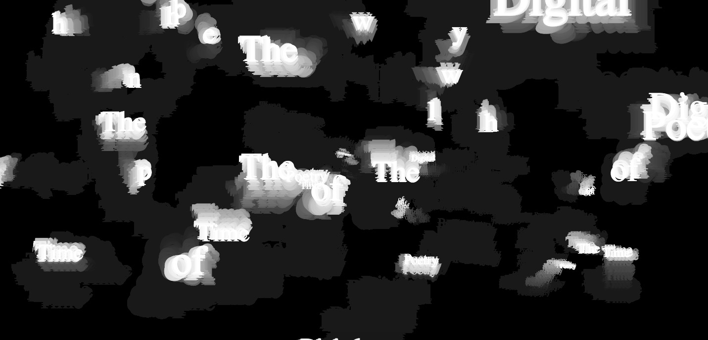
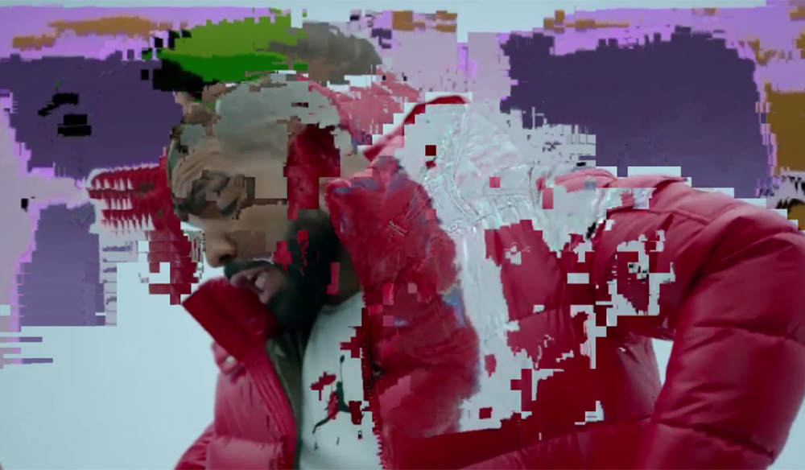

# code+words / week 8

## + major project research and developing paper prototypes

Read about V : Vniverse [here](http://www.stephaniestrickland.com/vniverse)

Watch a video of the online format [here](https://www.youtube.com/watch?v=TYT_5nD7zt8)






here are some photos from my paper prototype and my gif!

To continue working on my major project I have selected my preferred concept and further developed my paper prototype. While continuing to experiment with more paper prototypes, I decided that each word would reveal an image of an eye when you hovered your mouse over it in addition to oscillating between each set. The print related words will remain static and the digital ones will be animated. I initially had sketches using both transforming imagery and words, however, I kept coming back to the idea of user experience that Hayles discusses, so I decided to represent this by using an eye. 

This project ‘exists in print and on the Web as one work. In print, it is an invertible book with two beginnings…; online, it has two additional parts...’ Hayles uses the terms from my quote to describe the experience of interacting with the physical and digital portions of Strickland’s work interchangeably, with each slash being representative of ‘the space between the print book and digital Web site.’ I found the articulation of this synergetic process using juxtaposing expressions to be really insightful. Largely because it reinforces the primary notion of the entire reading – that materiality is individual to and dependent on the characteristics of a text from which they are intended to create meaning. 

To represent the user experience of V and these contrasting descriptors, I decided to pair each word with an animated or static image of a simple eye or set of eyes. These animations are reflective of the user’s actions or simply provide a visual representation of the word. These ‘in-between’ spaces can be as mundane as ‘the fraction of a second when we flip a page over and are neither or one page or another, [or] the microseconds between clicking on a star and seeing text appear’. She describes these ordinary instances of ‘in-between’ as a reminder ‘that gaps, ruptures, and fissures of undetermined duration and unspecified significance puncture our reading experiences.’  In contrast, she acclaims the in-between of V as being ‘charged with energy and significance’. Seemingly she has differing views on the potential of this unutilised space, differentiated by what seems to me is intention. 

What I took from this concept in my own work is only to reveal the image of the individual word that the user is hovering over, rather than both simultaneously. This in-between space of the time it takes to move the mouse between words emphasises the separation and so, their juxtaposition.


## + learning class



```
// a sketch to learn about "class" construction and also some wiggly letters
//class is a group of objects that have similar properties
var xPosition, yPosition, size, rand, letter, speed;
var letterCount = 0;
var sentence = ["The", "Time", "of", "Digital", "Poetry"];
var wigglyLetters = [];
function setup() {
  createCanvas(windowWidth,windowHeight);
  background (0);
  textSize(32);
  textFont("Times");
  xPosition = 100;
  yPosition = 100;
}

function draw() {
  background(0,5);
  fill(255);
  //text(frameCount,mouseX,mouseY);
  //ellipse(mouseX,mouseY,60,60);
  for (var i=0; i<wigglyLetters.length; i++) {
    wigglyLetters[i].wiggle();
    wigglyLetters[i].display();
  }
}

function mousePressed() {
  size = int(random(6,100));
  //letter = char(int(random(60,160)));
  letter = sentence[letterCount];
  wigglyLetters.push(new Wiggle (mouseX, mouseY, size, letter));
  if (letterCount<sentence.length){
    letterCount++;
  } else { 
      letterCount = 0; }
}
//instatiate and move/wiggle/juggle the letters

function keyTyped() {
  wigglyLetters.push (new Wiggle (xPosition, yPosition, 54, key));
  xPosition +=54;
}
class Wiggle {
  constructor (x, y, size, letter) {
    this.x = x;
    this.y = y;
    this.textSize = size;
    this.letter = letter;
  }
  wiggle() {
    //this.x += random (-2,2);
    //this.y += random (-2,2);
    speed = map(mouseY, 0, windowHeight, 0, 10);
    this.x += random (-speed, speed);
    this.y += random (-speed, speed);
  }
  
  display() {
    textSize(this.textSize);
    //text(char(int(random(60,160))), this.x, this.y);
    text(this.letter, this.x, this.y);
  }
}
```

During this week's power hour of code, Karen took us through a tutorial [learning class](https://celiamance.github.io/codewords/SKO/WEEK8/learningclass/)! Classes are used to apply the same characteristics to one or more objects, like a template, meaning that creating complicated sketches with multiple elements is more streamlined and easier to adapt overall elements. This was a really fun tutorial and introduced a perfect baseline to create infinite ideas.


## + datamoshing



This week we also spoke briefly about DataMoshing. It is a technique that I had never heard of before that produces really cool results, like in [this Kanye music video](https://www.youtube.com/watch?v=wMH0e8kIZtE). DataMoshing is defined as 'a technique of damaging video clips to create a glitch effect wherein frames that should change don't. It's most noticeable between cuts and across motion.' [Source](https://www.rocketstock.com/blog/datamoshing-learn-create-viral-effect/) 

Coincidentally, in my photography lecture this week on Friday they mentioned the trend of glitch photography and video, so I already had some insight on how this is created!


### [[Previous Week]](https://celiamance.github.io/codewords/SKO/WEEK7/) - [[Next Week]](https://celiamance.github.io/codewords/SKO/WEEK9/)
