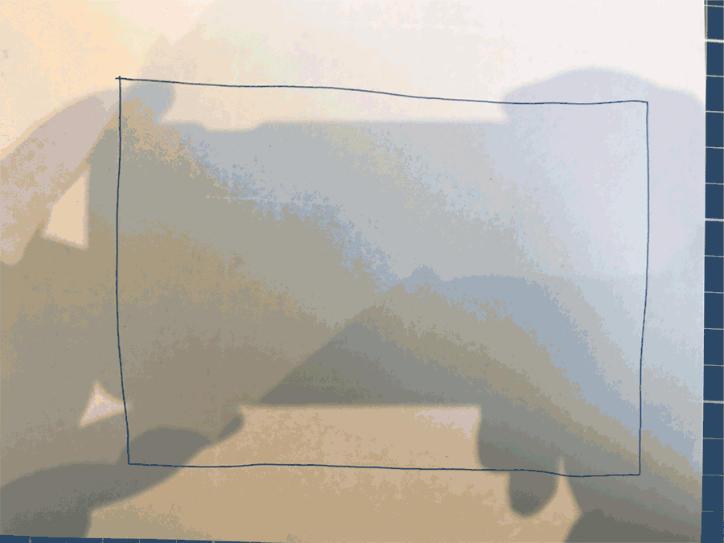
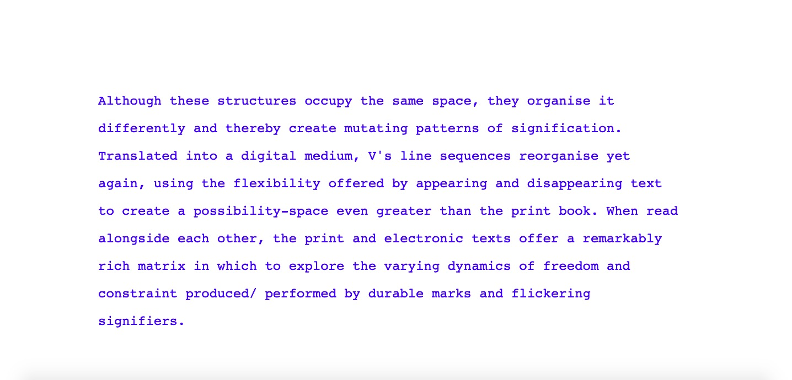
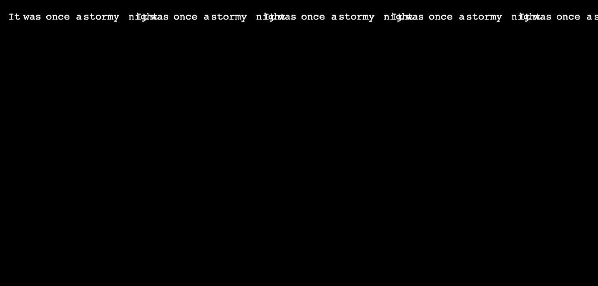
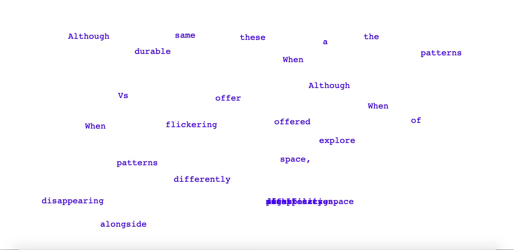
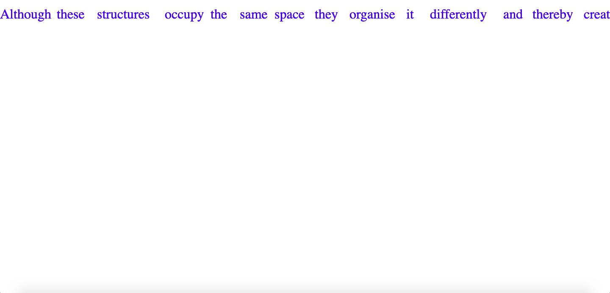

# code+words / week 9

## + major project development



I decided to change my concept idea as I wasn't happy with my previous outcome. I thought that while it had potential for visual engagement, it was not related enough to words, but rather materiality of a text. So, I decided to explore a new quote from the same text, (this is an extended version that includes more of the paragraph it came from) 

'Precisely because a print book (usually) consists of planar surfaces bound in an unchanging order, it opens multiple possibilities for spatial organizations and numbering schemes that play with and against the linear page order, inviting the reader to reorganize the work by conceptualising it as multiple interpenetrating structures, each offering possibilities for interpretation different from the others. Although these structures occupy the same space, they organize it differently and thereby create mutating patterns of signification. Translated into a digital medium, V's line sequences reorganize yet again, using the flexibility offered by appearing and disappearing text to create a possibility-space even greater than the print book. When read alongside each other, a remarkably rich matrix in which to explore the varying dynamics of freedom and constraint produced/ performed by the durable marks and flickering signifiers.' 

I wanted to capitalise on the possibilities Hayles discusses in the digital format, ‘creating mutating patterns of signification’. By presenting the text in a mutated/ randomly appearing order the meaning of the text is altered and hence, changes interpretation. This manipulation references the freedom of the digital space to easily create infinite ‘spatial organizations’, each offering different possibilities for interpretation.

Here are a couple of sketches to show my (slow) development of my major project.



```
//started from a sketch we did in class with Karen
//this is only very preliminary and I have basically only managed to print the text on the screen
//my goal is to have the text appear as if it were being typed
//eventually I would like the text to appear in a randomly generated order and then returns to the 'correct' order once the mouse is moved or some other function

var words;
function preload() {
}
var words = "Although these structures occupy the same space, they organise it differently and thereby create mutating patterns of signification. Translated into a digital medium, V's line sequences reorganise yet again, using the flexibility offered by appearing and disappearing text to create a possibility-space even greater than the print book. When read alongside each other, the print and electronic texts offer a remarkably rich matrix in which to explore the varying dynamics of freedom and constraint produced/ performed by durable marks and flickering signifiers.";

function setup() {
  createCanvas(windowWidth, windowHeight);
  textSize(24);
  noStroke();
  textFont("Monospace");
  textAlign(LEFT);
  fill(0,0,255);
  textLeading(50);
}


function draw() {
  background(255);
  text(words, int(windowWidth/8), windowHeight/4, int(windowWidth/4*3), windowHeight); 
}
```

[First](https://celiamance.github.io/codewords/SKO/WEEK9/paragraph/) I just printed the paragraph on the screen.



```
//created from Karen's amazing tutorial
// next I am trying to work out how to add in a limit to the X value and add in a y value so the text doesn't run off the page, but returns and continues to print the text

function setup() {
createCanvas(windowWidth, windowHeight);
background(0);
textSize(24);
textFont('Monospace');
letterX = 5;
sentence = 'It was once a stormy night';
words = sentence.split(' ');
frameRate(5);
}

function draw() {
  //background(0);
  noStroke();
  fill(255);
for (let i=0; i<words.length;i++){ 
  //if (frameCount > i*100){
    if (i>0){  
    for (let j=0; j<words[i-1].length; j++){
      letterX += 18;
    }
    }
    else { letterX += 18;}
   writeText(i, letterX);
}
function writeText(i, letterX){
text(words[i], letterX, 50); // words each on separate line
}
}
```

Then with help from Karen (a godsend) we were able to get the split function to work in [this sketch](https://celiamance.github.io/codewords/SKO/WEEK9/paragraph2/) after discovering that there had been some alterations to the function and the [p5js reference page](https://p5js.org/reference/#/p5/split) had not been updated.



```
var letterX, sentence, words;
var sentence = ('Although these structures occupy the same space, they organise it differently and thereby create mutating patterns of signification. Translated into a digital medium, Vs line sequences reorganise yet again, using the flexibility offered by appearing and disappearing text to create a possibility-space even greater than the print book. When read alongside each other, the print and electronic texts offer a remarkably rich matrix in which to explore the varying dynamics of freedom and constraint produced/ performed by durable marks and flickering signifiers.');
var words = sentence.split(' ');

function setup() {
  var xPosition = width/8;
  var yPosition = height/4;
  createCanvas(windowWidth, windowHeight);
  background(255);
  textSize(24);
  noStroke();
  textFont("Monospace");
  textAlign(LEFT);
  fill(0,0,255);
  textLeading(50);
  frameRate(2);
}

function draw() {
  text(random(words), mouseX,  mouseY);
}

function mousePressed(){
  background(255);
  text(sentence, int(windowWidth/8), windowHeight/4, int(windowWidth/4*3), windowHeight);
}
```

Then I started working on implementing the random function, but I struggled to get it to work with the typing words effect, so I came up with [this temporary solution](https://celiamance.github.io/codewords/SKO/WEEK9/paragraph3/).



```
// achieved with help from Ray!!
var sentence, words;

function setup() {
  sentence = ('Although these structures occupy the same space they organise it differently and thereby create mutating patterns of signification translated into a digital medium Vs line sequences reorganise yet again using the flexibility offered by appearing and disappearing text to create a possibility space even greater than the print book when read alongside each other the print and electronic texts offer a remarkably rich matrix in which to explore the varying dynamics of freedom and constraint produced performed by durable marks and flickering signifiers');
  words = sentence.split(' ');
  createCanvas(windowWidth, windowHeight);
  textSize(32);
  textFont('Times');
}

function draw() {
  background(255);
  noStroke();
  fill(0,0,255);
  var extraSpace = 0;
  for (let i = 0; i < words.length; i++) {
  if (frameCount > i * 50) {
  var wordMarginLeft = 30 * i;  
  if (i > 0) {
     extraSpace = extraSpace + words[i - 1].length * 13;
  }
  text(words[i], wordMarginLeft + extraSpace, 20, width, height);
  }
 }
}
```

With help from Ray we got the typing effect to work properly in [this sketch](https://celiamance.github.io/codewords/SKO/WEEK9/paragraph_4/).
I'm now trying to work on adding a right side margin which is proving harder than I initally thought, and imputting the random function, which also doesn't seem to work easily! I changed to my new idea both in hopes of creating a more text oriented outcome and also a more achievable outcome, but I'm learning that often things are far more complicated than you expect in code!!


### [[Previous Week]](https://celiamance.github.io/codewords/SKO/WEEK8/) - [[Next Week]](https://celiamance.github.io/codewords/SKO/WEEK10/)
